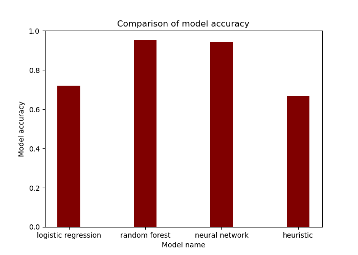
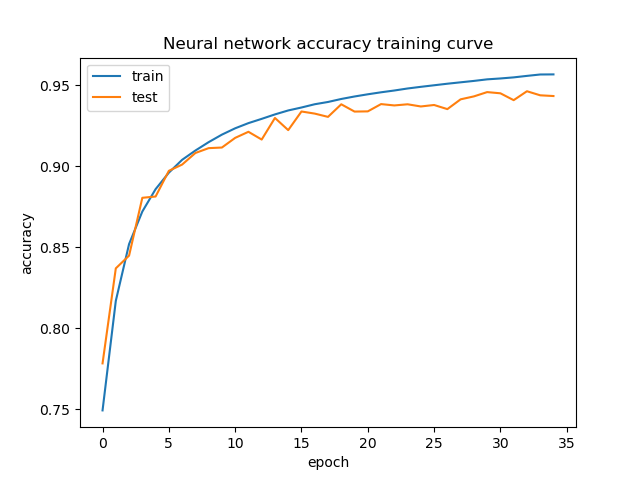
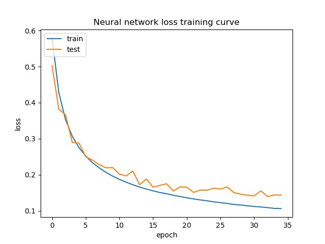
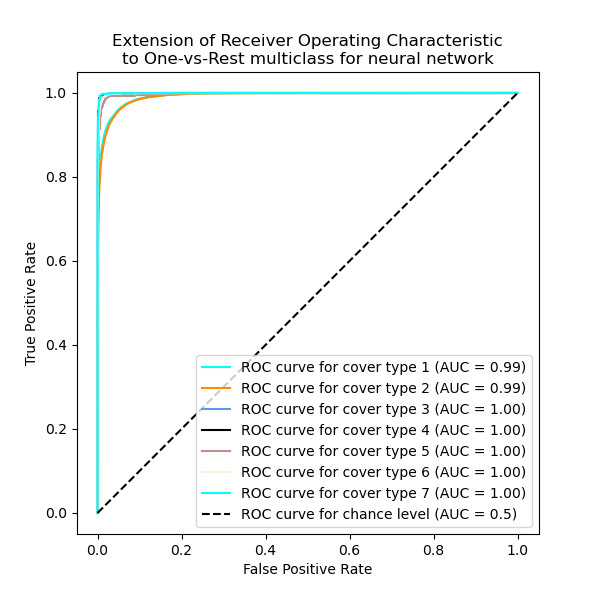
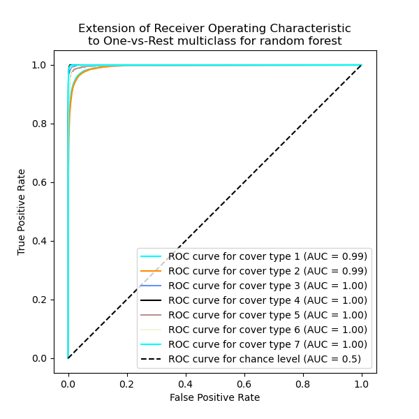
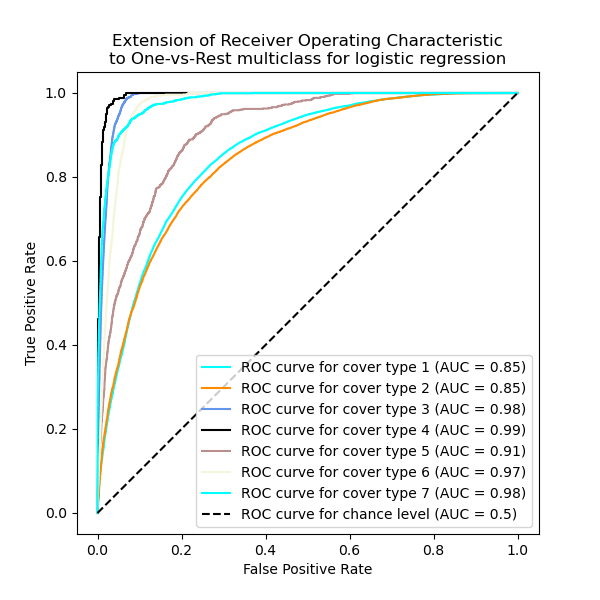

# FOREST COVER TYPE DATASET MACHINE LEARNING MODELS

## 1. Project description

This project contains four models that perform [forest cover type](https://archive.ics.uci.edu/ml/datasets/Covertype) predictions:
1. a simple heuristic that assigns the type of cover most frequently occurring at a given elevation (a more complex one could additionally use "Wilderness_Area" - information that is quite strongly linked to the target)
2. logistic regression with some of the columns selected using the mutual information
3. random forest classifier with some of the columns selected in the same way, the number of  estimators limited to 50, and the maximum depth set to 30; it's possible to obtain a little higher score with more estimators and deeper trees, but the file with the trained model would be much larger
4. neural network with 3 hidden layers and hyperparameters tuned using Optuna (you can find the parameters in [this file](app/models/saved/best_nn_params.csv))

## 2. Application running instructions

In [app/models/saved](app/models/saved) there are saved models, but if you want to train them on your own, download the dataset from [this link](https://archive.ics.uci.edu/ml/machine-learning-databases/covtype/covtype.data.gz) and extract it to the root folder.

To run the application, install [Docker](https://docs.docker.com/get-docker/) and execute commands in the root folder:

```commandline
docker build -t covertype-image .
docker run -d --name mycontainer -p 80:80 covertype-image
```

Now you can use the API directly or via Swagger with the documentation: http://127.0.0.1/docs

## 3. Evaluation of models, neural network training curve

The script displaying the model comparison and learning curves can be found [in this file](scripts/comparison.py). Its execution takes some time, so I display the graphs here as well:



<p float="left">
  
   
</p>


<p float="left">
   
   
</p>
